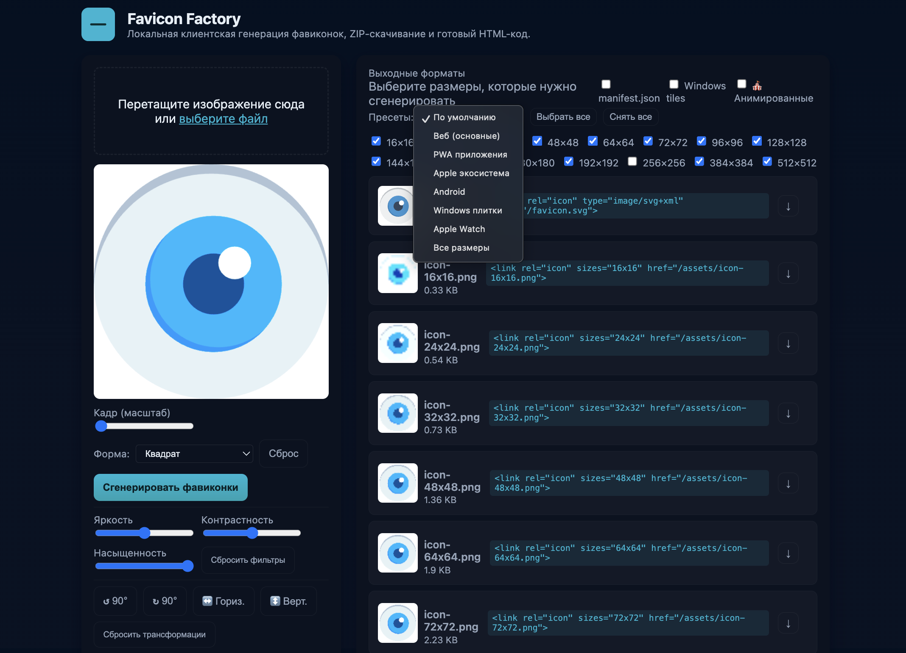

**Бесплатный и на 100% клиентский инструмент** для генерации всего спектра фавиконок и файлов манифестов из одного изображения (не путать с генерацией от AI). Больше не нужно ничего устанавливать или загружать файлы на сервер — всё работает прямо в вашем браузере.

➡️ **Попробуйте прямо сейчас: [https://mendegar.github.io/favicon-factory/](https://mendegar.github.io/favicon-factory/)**



## ✨ Возможности

Favicon Factory — это самый полный инструмент для подготовки фавиконок, который избавит вас от рутины раз и навсегда.

| Функция | Описание | 🤔 Зачем это нужно? |
| :--- | :--- | :--- |
| **🖼️ Drag & Drop Загрузка** | Просто перетащите PNG, JPG, SVG | Максимально быстрый старт |
| **📐 Умное Обрезание** | Точный кроп и масштабирование под любые формы | Идеальные квадратные иконки из любых исходников |
| **🎯 Все Стандартные Размеры** | Генерация от 16x16 до 512x512 | Полное покрытие для всех браузеров и устройств |
| **📦 Единый ZIP-архив** | Скачайте все файлы одной кнопкой | Не нужно сохранять каждый файл по отдельности |
| **📋 Готовый HTML-код** | Автоматическая генерация кода для вставки в `<head>` | Скопировал — вставил — работает |
| **⚙️ PWA & Manifest** | Создание `manifest.webmanifest` | Для прогрессивных веб-приложений |
| **🪟 Windows Tiles** | Поддержка `browserconfig.xml` | Красивые плитки при закреплении сайта в Windows |
| **🔮 SVG Support** | Конвертация векторной графики во все форматы | Используйте один SVG-файл для всего |

## 🚀 Быстрый Старт

Создайте полный набор фавиконок меньше чем за 30 секунд:

1.  **Перейдите** на [https://mendegar.github.io/favicon-factory/](https://mendegar.github.io/favicon-factory/)
2.  **Перетащите** или загрузите вручную ваше изображение (рекомендуется минимум 512x512px) в область загрузки.
3.  **Настройте** область обрезки, если это необходимо.
4.  **Нажмите** "Сгенерировать Фавиконки".
5.  **Скачайте** ZIP-архив со всеми файлами или каждый отдельно и скопируйте готовый HTML-код.

**Всё!** Никаких сложных редакторов, командных строк и лишних программ.

## 🛠️ Для Разработчиков

Favicon Factory — open-source проект с полным CI/CD пайплайном.

### Установка и Запуск

```bash
# Клонируйте репозиторий
git clone https://github.com/mendegar/favicon-factory.git

# Установите зависимости (если есть)
npm install

# Запустите локальный сервер для разработки
npm run dev
# или используйте Python, на маках 5001 не стартуйте, 8081 почти всегда норм
python -m http.server 8000